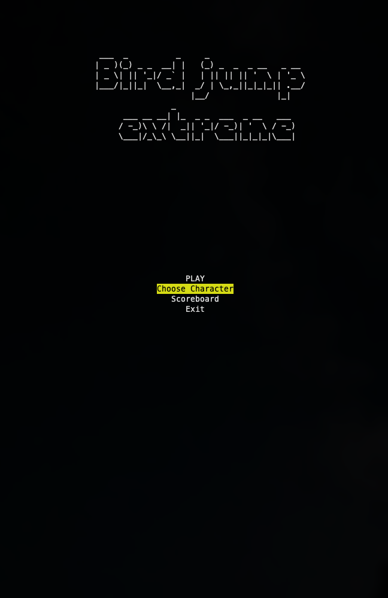
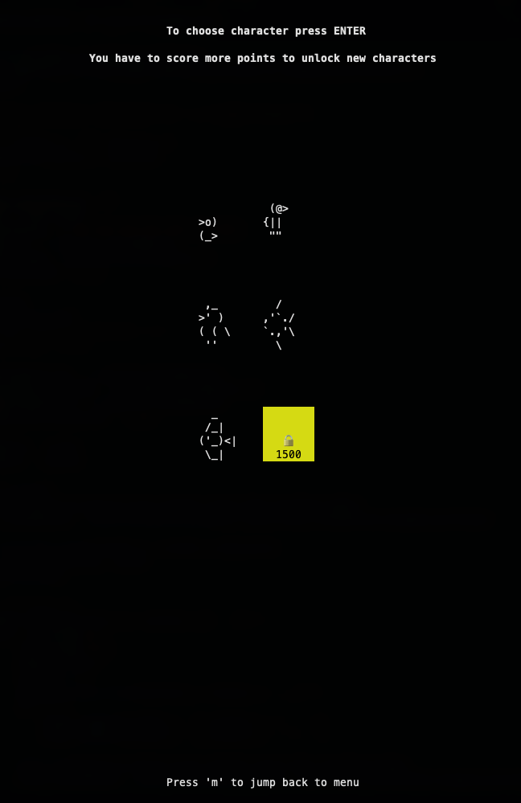
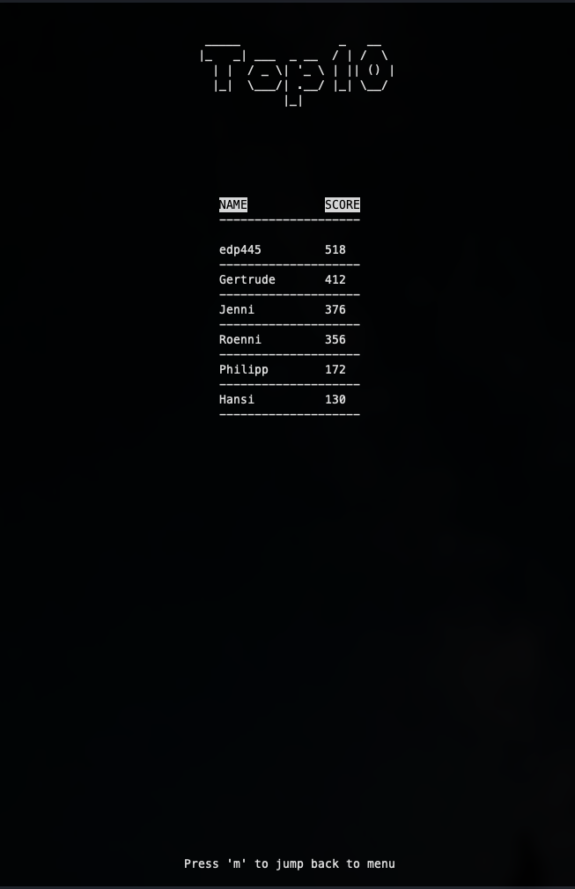

```
 ________  ___  ________  ________             ___  ___  ___  _____ ______   ________      
|\   __  \|\  \|\   __  \|\   ___ \           |\  \|\  \|\  \|\   _ \  _   \|\   __  \     
\ \  \|\ /\ \  \ \  \|\  \ \  \_|\ \          \ \  \ \  \\\  \ \  \\\__\ \  \ \  \|\  \    
 \ \   __  \ \  \ \   _  _\ \  \ \\ \       __ \ \  \ \  \\\  \ \  \\|__| \  \ \   ____\   
  \ \  \|\  \ \  \ \  \\  \\ \  \_\\ \     |\  \\_\  \ \  \\\  \ \  \    \ \  \ \  \___|   
   \ \_______\ \__\ \__\\ _\\ \_______\    \ \________\ \_______\ \__\    \ \__\ \__\      
    \|_______|\|__|\|__|\|__|\|_______|     \|________|\|_______|\|__|     \|__|\|__|                                                                                                   
                      ▓█████ ▒██   ██▒▄▄▄█████▓ ██▀███  ▓█████  ███▄ ▄███▓▓█████ 
                      ▓█   ▀ ▒▒ █ █ ▒░▓  ██▒ ▓▒▓██ ▒ ██▒▓█   ▀ ▓██▒▀█▀ ██▒▓█   ▀ 
                      ▒███   ░░  █   ░▒ ▓██░ ▒░▓██ ░▄█ ▒▒███   ▓██    ▓██░▒███   
                      ▒▓█  ▄  ░ █ █ ▒ ░ ▓██▓ ░ ▒██▀▀█▄  ▒▓█  ▄ ▒██    ▒██ ▒▓█  ▄ 
                      ░▒████▒▒██▒ ▒██▒  ▒██▒ ░ ░██▓ ▒██▒░▒████▒▒██▒   ░██▒░▒████▒
                      ░░ ▒░ ░▒▒ ░ ░▓ ░  ▒ ░░   ░ ▒▓ ░▒▓░░░ ▒░ ░░ ▒░   ░  ░░░ ▒░ ░
                       ░ ░  ░░░   ░▒ ░    ░      ░▒ ░ ▒░ ░ ░  ░░  ░      ░ ░ ░  ░
                         ░    ░    ░    ░        ░░   ░    ░   ░      ░      ░   
                         ░  ░ ░    ░              ░        ░  ░       ░      ░  ░

```
---
# BirdJump Extreme 🦅


### 1. Introduction
BirdJump is inspired by Doodle Jump. It's a lightweight & minimalistic mini-game for your terminal. You can choose between different characters which you unlock by having higher and higher scores. You can keep track of your scores in the Scoreboard-screen where the Top-10 best on your local device are saved:

Main menu             |  Character screen             | Scoreboard screen
:-------------------------:|:-------------------------:|:-------------------------:
  |  | 

---
### 2.Installation
```
  git clone blabla
```

---
### 3. How to play

* You jump from platform to platform trying to go as high as you can
* But watchout there are fake-platforms (marked yellow) which you can't jump on
  * Fake-platforms also get deleted randomly
* The higher your the harder it gets
* When you have scored enough points you can unlock new characters

---
### 4. Have fun!
insert gif
